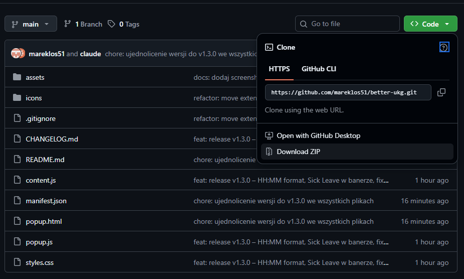

# ⏱ Better UKG

Rozszerzenie przeglądarki **Microsoft Edge / Chrome** dla systemu **UKG Pro**, które automatycznie oblicza saldo czasu elastycznego (flex) na podstawie timesheeta i wyświetla je jako pasek na górze strony. Dodatkowo przelicza salda urlopowe z godzin na dni.

---

## Funkcjonalności

### Kalkulator czasu flex (Timesheet)

Wtyczka odczytuje dane bezpośrednio z timesheeta i oblicza:

- **Saldo flex** (`+HH:MM` / `-HH:MM`) — ile godzin jesteś przed lub za normą *na dziś*
- **Przepracowane / norma miesiąca** — łączna liczba godzin vs pełna norma miesięczna
- **Pozostało** — ile godzin zostało do wyrobienia normy do końca miesiąca
- **Overtime Payout** — godziny oznaczone jako *Overtime Payout* w kolumnie Activity są automatycznie **wykluczone** z salda flex
- **Sick Leave** — możliwość uwzględnienia dni chorobowych bez wpisu w timesheecie (dodaje godziny do salda flex)
- **Sugestia godziny wyjścia** — na ostatni dzień roboczy miesiąca, po wpisaniu godziny Clock In, baner automatycznie podpowiada o której wyjść, żeby wyzerować saldo flex

Sumy godzin w wierszach podsumowujących dzień są wyświetlane w formacie **HH:MM** zamiast domyślnego `X.XX hrs`:

### Menu wtyczki

Kliknij ikonę ⏱ na pasku przeglądarki, aby otworzyć panel z saldem flex i ustawieniami:

### Salda urlopowe (Time Off Balances)

Na stronie `Time Off → Balances` wtyczka automatycznie przelicza salda urlopowe z godzin na dni dla kart **Vacation** i **Childcare PTO**:

- Duże saldo (`192.00 hours` → `24 days`)
- Wszystkie pozycje na liście (`Current Accrued`, `Current Balance`, `Taken`, `Scheduled`, `Requested`, `Available Balance`)

Na stronie `Time Off → Request` wtyczka automatycznie przelicza saldo urlopowe z godzin na dni:

Działa zarówno w widoku pracownika (`My Time`) jak i w widoku menedżera (`Manage → Time`).

---

## Jak to działa

| Co | Jak |
|---|---|
| Norma | Dni robocze (Pn–Pt) w miesiącu × 8h |
| Saldo vs dziś | Przepracowane − (minione dni robocze × 8h) |
| Urlopy / PTO / Holiday | Wpisane w UKG jako 8h → naturalnie wliczają się do normy |
| Overtime Payout | Wykrywane po polu `Activity` i odejmowane od sumy flex |
| Przelicznik urlopu | Godziny ÷ 8 = dni (konfigurowalne w menu wtyczki) |
| Odświeżanie | Automatyczne po nawigacji i zmianie danych (odśwież stronę) |
| Sick Leave | Przy nie wpisanym sick leave, możesz wprowadzić korektę o ilość dni |

---

## Instalacja w Microsoft Edge / Chrome

### Krok 1 – Pobierz pliki

1. Kliknij zielony przycisk **Code** → **Download ZIP** na górze strony.

2. Rozpakuj archiwum w dowolnym folderze (np. na pulpicie)

### Krok 2 – Włącz tryb dewelopera i załaduj rozszerzenie

1. W pasku adresu wpisz `edge://extensions` (lub `chrome://extensions`)
2. Włącz przełącznik **„Tryb dewelopera"** / **„Developer mode"**
3. Kliknij **„Załaduj rozpakowane"** / **„Load unpacked"**

### Krok 3 – Wskaż folder z rozszerzeniem

Wskaż folder, który właśnie rozpakowałeś (ten, w którym jest plik `manifest.json` — zazwyczaj `better-ukg-main`).

### Krok 4 – Gotowe!

Przejdź do timesheeta w UKG Pro — baner z saldem flex pojawi się automatycznie na górze strony.

> **Uwaga (Edge):** Edge będzie przypominał o włączonym trybie dewelopera. Możesz to przypomnienie odsuwać co 2 tygodnie.

### Opcjonalnie – Przypnij ikonę do paska

Kliknij ikonę puzzli na pasku przeglądarki i przypnij **Better UKG**, aby mieć szybki dostęp do panelu ustawień.

---

## Historia wersji

### v1.4.0
- **Sugestia godziny wyjścia** na ostatni dzień roboczy miesiąca — po wpisaniu Clock In (bez Clock Out) baner pokazuje `🏁 Wyjdź o: HH:MM` — godzinę, o której należy wyjść, żeby wyzerować saldo flex

### v1.3.0
- Sumy godzin w formacie **HH:MM** zamiast `X.XX hrs` (toggle w ustawieniach)
- Sick Leave dostępny bezpośrednio w banerze
- Baner nie przesuwa już zawartości strony — naprawiono ucinanie ostatniego dnia miesiąca

### v1.2.0
- Zmiana nazwy wtyczki na **Better UKG**
- Przeliczanie sald urlopowych z godzin na dni na stronie **Time Off Balances** (Vacation i Childcare PTO)
- Obsługa widoku menedżerskiego (`manage/time/timeoff/balances`)
- Toggle w menu wtyczki: **Urlop w dniach / godzinach** (działa natychmiast, bez zapisywania)

### v1.1.0
- Obsługa strony `Time Off → Request` — salda urlopowe przeliczane na dni
- Obsługa przypadku gdy dzisiejszy dzień jest pusty w timesheecie

### v1.0.0
- Pierwsze wydanie: kalkulator salda flex z banerem na górze strony
- Wykluczanie Overtime Payout z kalkulacji
- Obsługa Sick Leave
- Panel ustawień w popup

---

---

> **Disclaimer:** This extension is for informational purposes only. The flex balance displayed is an estimate based on data read from the timesheet and may not reflect all factors affecting your working time. Always verify your hours independently using official UKG Pro reports.

*Better UKG v1.4 by Marek Łoś · UKG Pro*
