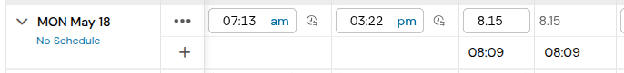
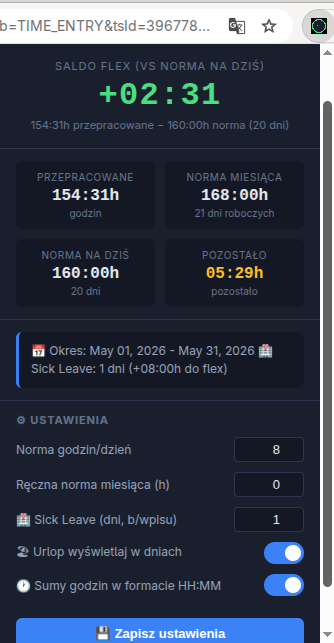
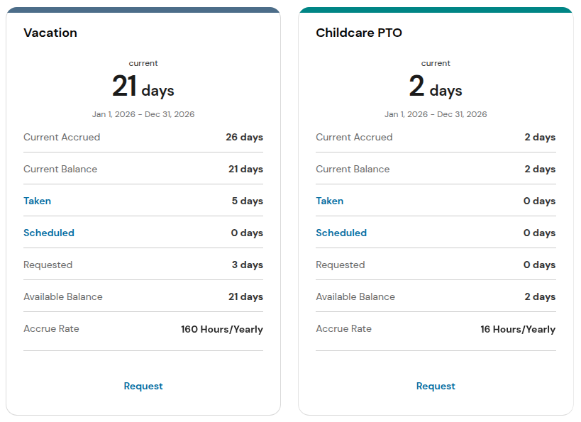
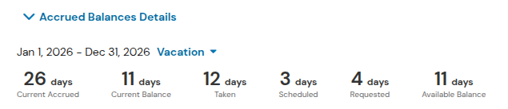
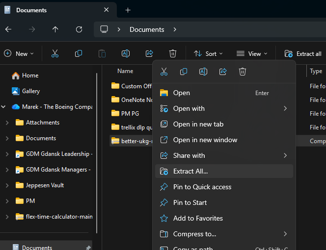
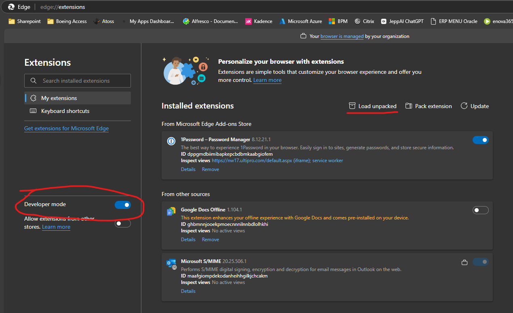
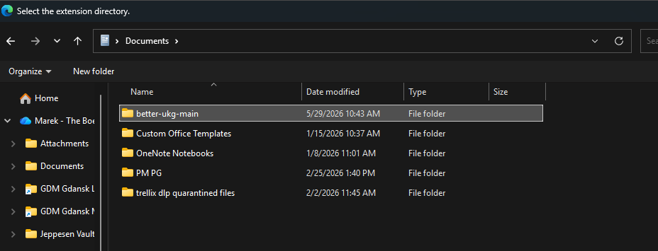
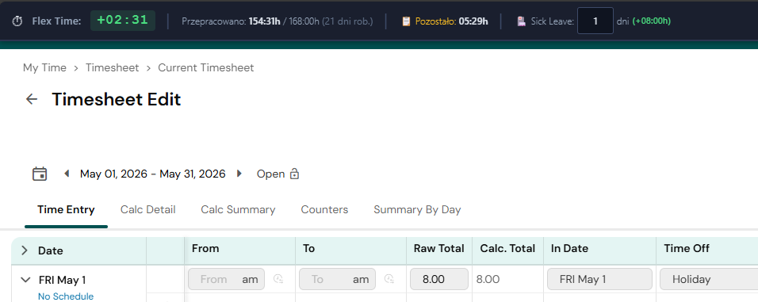
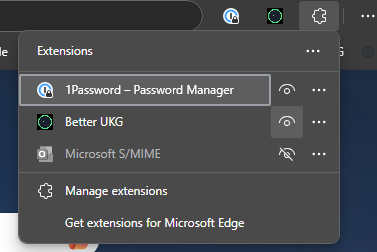

# ⏱ Better UKG

Rozszerzenie przeglądarki **Microsoft Edge / Chrome** dla systemu **UKG Pro**, które automatycznie oblicza saldo czasu elastycznego (flex) na podstawie timesheeta i wyświetla je jako pasek na górze strony. Dodatkowo przelicza salda urlopowe z godzin na dni.

| Przeglądarka | Pobierz |
|---|---|
| **Edge / Chrome** | [better-ukg-1.5.3-edge-chrome.zip](https://github.com/mareklos51/better-ukg/releases/download/v1.5.3/better-ukg-1.5.3-edge-chrome.zip) |
| **Firefox** | [better-ukg-1.5.3-firefox.zip](https://github.com/mareklos51/better-ukg/releases/download/v1.5.3/better-ukg-1.5.3-firefox.zip) |

---

## Funkcjonalności

### Kalkulator czasu flex (Timesheet)

Wtyczka odczytuje dane bezpośrednio z timesheeta i oblicza:

- **Saldo flex** (`+HH:MM` / `-HH:MM`) — ile godzin jesteś przed lub za normą *na dziś*
- **Przepracowane / norma miesiąca** — łączna liczba godzin vs pełna norma miesięczna
- **Pozostało** — ile godzin zostało do wyrobienia normy do końca miesiąca
- **Overtime Payout** — godziny oznaczone jako *Overtime Payout* w kolumnie Activity są automatycznie **wykluczone** z salda flex
- **Korekta ręczna** — pole w banerze i w menu wtyczki pozwala dodać lub odjąć dowolną liczbę godzin od salda flex (np. `-4`, `+8`, `-4.5`); przydatne gdy UKG liczy coś niestandardowo i wtyczka pokazuje błędne saldo
- **Sugestia godziny wyjścia** — na ostatni dzień roboczy miesiąca, po wpisaniu godziny Clock In, baner automatycznie podpowiada o której wyjść, żeby wyzerować saldo flex

Sumy godzin w wierszach podsumowujących dzień są wyświetlane w formacie **HH:MM** zamiast domyślnego `X.XX hrs`:

### Menu wtyczki

Kliknij ikonę ⏱ na pasku przeglądarki, aby otworzyć panel z saldem flex i ustawieniami:

### Salda urlopowe (Time Off Balances)

Na stronie `Time Off → Balances` wtyczka automatycznie przelicza salda urlopowe z godzin na dni dla kart **Vacation** i **Childcare PTO**:

- Duże saldo (`192.00 hours` → `24 days`)
- Wszystkie pozycje na liście (`Current Accrued`, `Current Balance`, `Taken`, `Scheduled`, `Requested`, `Available Balance`)

Na stronie `Time Off → Request` wtyczka automatycznie przelicza saldo urlopowe z godzin na dni:

Działa zarówno w widoku pracownika (`My Time`) jak i w widoku menedżera (`Manage → Time`).

---

## Jak to działa

| Co | Jak |
|---|---|
| Norma | Dni robocze (Pn–Pt) w miesiącu × 8h |
| Saldo vs dziś | Przepracowane − (minione dni robocze × 8h) |
| Urlopy / PTO / Holiday | Wpisane w UKG jako 8h → naturalnie wliczają się do normy |
| Overtime Payout | Wykrywane po polu `Activity` i odejmowane od sumy flex |
| Przelicznik urlopu | Godziny ÷ 8 = dni (konfigurowalne w menu wtyczki) |
| Odświeżanie | Automatyczne po nawigacji i zmianie danych (odśwież stronę) |
| Korekta ręczna | Pole `🔧` w banerze i menu wtyczki — dodaje lub odejmuje podaną liczbę godzin od salda (obsługuje wartości ujemne i ułamkowe, np. `-4`, `+8`, `-4.5`) |

---

## Instalacja w Microsoft Edge / Chrome

### Krok 1 – Pobierz pliki

Pobierz paczkę odpowiednią dla swojej przeglądarki:

| Przeglądarka | Pobierz |
|---|---|
| **Edge / Chrome** | [better-ukg-1.5.3-edge-chrome.zip](https://github.com/mareklos51/better-ukg/releases/download/v1.5.3/better-ukg-1.5.3-edge-chrome.zip) |
| **Firefox** | [better-ukg-1.5.3-firefox.zip](https://github.com/mareklos51/better-ukg/releases/download/v1.5.3/better-ukg-1.5.3-firefox.zip) |

Rozpakuj archiwum w dowolnym folderze (np. na pulpicie)

### Krok 2 – Włącz tryb dewelopera i załaduj rozszerzenie

1. W pasku adresu wpisz `edge://extensions` (lub `chrome://extensions`)
2. Włącz przełącznik **„Tryb dewelopera"** / **„Developer mode"**
3. Kliknij **„Załaduj rozpakowane"** / **„Load unpacked"**

### Krok 3 – Wskaż folder z rozszerzeniem

Wskaż folder, który właśnie rozpakowałeś (ten, w którym jest plik `manifest.json` — zazwyczaj `better-ukg-main`).

### Krok 4 – Gotowe!

Przejdź do timesheeta w UKG Pro — baner z saldem flex pojawi się automatycznie na górze strony.

> **Uwaga (Edge):** Edge będzie przypominał o włączonym trybie dewelopera. Możesz to przypomnienie odsuwać co 2 tygodnie.

### Opcjonalnie – Przypnij ikonę do paska

Kliknij ikonę puzzli na pasku przeglądarki i przypnij **Better UKG**, aby mieć szybki dostęp do panelu ustawień.

---

## Historia wersji

### v1.5.3

- **Korekta ręczna** — pole *Sick Leave (dni)* zastąpione polem `🔧 Korekta ręczna (h)`, które przyjmuje dowolną liczbę godzin ze znakiem (np. `-4`, `+8`, `-4.5`). Przydatne gdy UKG liczy coś niestandardowo i wtyczka pokazuje błędne saldo.
- **Bugfix absencja dzisiaj** — gdy bieżący dzień jest dniem absencji (Child Care, Blood Donation, Vacation on Demand itp.) saldo flex było zawyżone o wartość normy dziennej. Naprawiono.

### v1.5.2

- **UX:** Dzienny widget flex — neutralne tło zamiast kolorowania całego pola; kolor tekstu każdej wartości zależy od jej znaku niezależnie: delta dnia i suma skumulowana mają osobne kolory (zielony `+` / czerwony `−`), co pozwala odczytać oba sygnały jednocześnie (np. `+01:00` zielony, ale `∑ −04:00` czerwony)

### v1.5.1

- **Bugfix:** Poprawiono wykrywanie wpisów *Time Off in Lieu* — UKG zapisuje wartość jako `"Time Off In Lieu"` (duże I i L), przez co porównanie case-sensitive nie znajdowało wpisów i TOIL nie był odejmowany z salda flex

### v1.5.0

- **Dzienny widget flex** — pod sumą godzin każdego dnia pojawia się mały pasek z deltą dnia (`+01:00` / `-00:30`) oraz skumulowanym saldem flex (`∑ +01:00`). Tło zmienia się na zielone gdy saldo jest na plusie, czerwone gdy na minusie
- **Holiday** — dni z wpisem *Time Off: Holiday* są automatycznie wykrywane i wyłączone z liczby dni roboczych; widoczne osobno w opisie normy: `176:00h (21 dni rob. (168h) + 1 Holiday (8h))`
- **Time Off in Lieu (TOIL)** — godziny z wpisem *Time Off in Lieu* są odejmowane od przepracowanych godzin (analogicznie do Overtime Payout); widoczne w banerze jako `🔒 TOIL: 08:00h`
- **Filtrowanie przyszłych dat** — wpisy z datą w przyszłości (np. Holiday wpisany z góry przez dział HR) nie wpływają na saldo flex bieżącego dnia
- **Disclaimer** — informacja *"For informational purposes only"* dodana w opisie rozszerzenia, menu wtyczki i README

### v1.4.0
- **Sugestia godziny wyjścia** na ostatni dzień roboczy miesiąca — po wpisaniu Clock In (bez Clock Out) baner pokazuje `🏁 Wyjdź o: HH:MM` — godzinę, o której należy wyjść, żeby wyzerować saldo flex

### v1.3.0
- Sumy godzin w formacie **HH:MM** zamiast `X.XX hrs` (toggle w ustawieniach)
- Sick Leave dostępny bezpośrednio w banerze
- Baner nie przesuwa już zawartości strony — naprawiono ucinanie ostatniego dnia miesiąca

### v1.2.0
- Zmiana nazwy wtyczki na **Better UKG**
- Przeliczanie sald urlopowych z godzin na dni na stronie **Time Off Balances** (Vacation i Childcare PTO)
- Obsługa widoku menedżerskiego (`manage/time/timeoff/balances`)
- Toggle w menu wtyczki: **Urlop w dniach / godzinach** (działa natychmiast, bez zapisywania)

### v1.1.0
- Obsługa strony `Time Off → Request` — salda urlopowe przeliczane na dni
- Obsługa przypadku gdy dzisiejszy dzień jest pusty w timesheecie

### v1.0.0
- Pierwsze wydanie: kalkulator salda flex z banerem na górze strony
- Wykluczanie Overtime Payout z kalkulacji
- Obsługa Sick Leave
- Panel ustawień w popup

---

---

> **Disclaimer:** This extension is for informational purposes only. The flex balance displayed is an estimate based on data read from the timesheet and may not reflect all factors affecting your working time. Always verify your hours independently using official UKG Pro reports.

*Better UKG v1.5.3 by Marek Łoś · UKG Pro*
